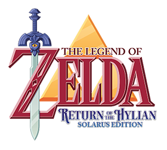

#  Zelda Return of the Hylian

**Zelda Return of the Hylian _Solarus Edition_** is a remake of the original [Zelda Return of the Hylian](http://www.zeldaroth.fr), a short and pleasant fangame from Vincent Jouillat. The original game was developed in C++ and was released in 2006.

This new version was developed with the [Solarus engine](https://github.com/christopho/solarus) by Christopho, Mymy and Vincent Jouillat.
While this is essentially the same game, a lot of details were improved thanks to the use of Solarus.

You can watch a video of this [Zelda Return of the Hylian remake](https://www.youtube.com/watch?v=DUmeln2kDTg).

For users interested in creating games with Solarus, this project is also a great source of scripts.
All weapons are scripted, including the hammer, the hookshot, the bow, the fire rod and the ice rod.
There is also an elaborate dungeon room system using separators, with automatic restoration of enemies and pots.

The game is available in French and English for now.
To play, you need [Solarus](https://github.com/christopho/solarus).

